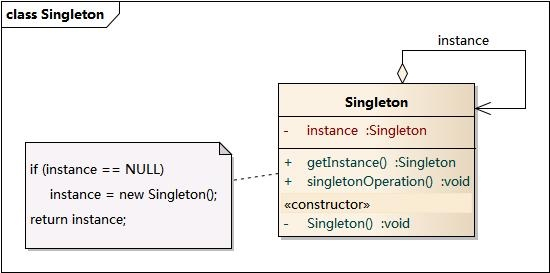

# 单例模式
单例模式(Singleton Pattern)：单例模式确保某一个类只有一个实例，而且自行实例化并向整个系统提供这个实例，这个类称为单例类，它提供全局访问的方法。

单例模式的要点有三个：
- 是某个类只能有一个实例；
- 是它必须自行创建这个实例；
- 是它必须自行向整个系统提供这个实例。

单例模式是一种对象创建型模式。单例模式又名单件模式或单态模式。

## 单例模式结构
单例模式的目的是保证一个类仅有一个实例，并提供一个访问它的全局访问点。

单例模式包含的角色只有一个，就是单例类——Singleton。

单例类拥有一个私有构造函数，确保用户无法通过new关键字直接实例化它。

除此之外，该模式中包含一个静态私有成员变量与静态公有的工厂方法，该工厂方法负责检验实例的存在性并实例化自己，然后存储在静态成员变量中，以确保只有一个实例被创建。

在单例模式的实现过程中，需要注意如下三点：
- 单例类的构造函数为私有；
- 提供一个自身的静态私有成员变量；
- 提供一个公有的静态工厂方法。



## 常见的单例实现
### 饿汉模式
```java
public class Singleton {  
     private static Singleton instance = new Singleton();  
     private Singleton (){
     }
     public static Singleton getInstance() {  
     return instance;  
     }  
 }  
```

### 懒汉模式
```java
public class Singleton {

    private Singleton(){} // 私有构造

    private static volatile Singleton instance = null; // 私有单例对象

    // 静态工厂
    public static Singleton getInstance(){
        if (instance == null) { // 双重检测机制
            synchronized (Singleton.class) { // 同步锁
                if (instance == null) { // 双重检测机制
                    instance = new Singleton();
                }
            }
        }
        return instance;
    }

}

```
### 静态内部类实现方式

```java
/**
 * 从外部无法访问静态内部类 LazyHolder，只有当调用 Singleton.getInstance() 方法的时候，才能得到单例对象 INSTANCE。
* INSTANCE 对象初始化的时机并不是在单例类 Singleton 被加载的时候，而是在调用 getInstance 方法，使得静态内部类 LazyHolder 被加载的时候。
* 这种实现方式是利用classloader的加载机制来实现懒加载，并保证构建单例的线程安全。
 */
public class Singleton {

    private static class LazyHolder {
        private static final Singleton INSTANCE = new Singleton();
    }

    private Singleton (){}

    public static Singleton getInstance() {
        return LazyHolder.INSTANCE;
    }

}

```

### 使用容器实现

```java
public class SingletonManager { 
　　private static Map<String, Object> objMap = new HashMap<String,Object>();
　　private Singleton() { 
　　}
　　public static void registerService(String key, Object instance) {
　　　　if (!objMap.containsKey(key) ) {
　　　　　　objMap.put(key, instance) ;
　　　　}
　　}
　　public static Object getService(String key) {
　　　　return objMap.get(key) ;
　　}
}
```

### 枚举实现

```java
public enum Singleton {
    INSTANCE;
    
    public void doSomeThing() {
        //做点什么
    }  
}
```

## 使用场景

系统只需要一个实例对象，如系统要求提供一个唯一的序列号生成器，或者需要考虑资源消耗太大而只允许创建一个对象。

客户调用类的单个实例只允许使用一个公共访问点，除了该公共访问点，不能通过其他途径访问该实例。

在一个系统中要求一个类只有一个实例时才应当使用单例模式。反过来，如果一个类可以有几个实例共存，就需要对单例模式进行改进，使之成为多例模式
