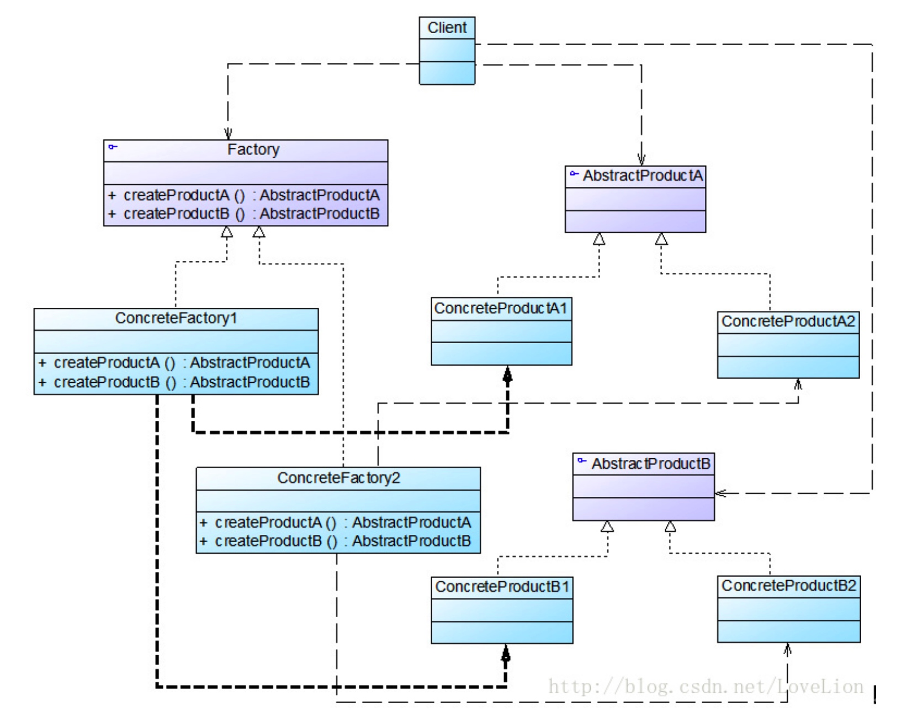

# 工厂模式

工厂模式主要是为创建对象提供过渡接口，以便将创建对象的具体过程屏蔽隔离起来，
达到提高灵活性的目的。

工厂模式在《Java 与模式》中分为三类:
- 简单工厂模式(Simple Factory)
- 工厂方法模式(Factory Method)
- 抽象工厂模式(Abstract Factory) 
这三种模式从上到下逐步抽象，并且更具一般性

## 简单工厂模式
先来看看它的组成:
1) 工厂类角色:这是本模式的核心，含有一定的商业逻辑和判断逻辑。
2) 抽象对象角色:它一般是具体产品继承的父类或者实现的接口
3) 具体产品角色:工厂类所创建的对象就是此角色的实例。


-------

## 工厂方法模式
工厂方法模式(Factory Method Pattern)又称为工厂模式，也叫虚拟构造器(Virtual Constructor)模式或者多态工厂(Polymorphic Factory)模式，它属于类创建型模式。在工厂方法模式中，工厂父类负责定义创建产品对象的公共接口，而工厂子类则负责生成具体的产品对象，这样做的目的是将产品类的实例化操作延迟到工厂子类中完成，即通过工厂子类来确定究竟应该实例化哪一个具体产品类。

工厂方法模式是简单工厂模式的进一步抽象和推广。由于使用了面向对象的多态性，工厂方法模式保持了简单工厂模式的优点，而且克服了它的缺点。在工厂方法模式中，核心的工厂类不再负责所有产品的创建，而是将具体创建工作交给子类去做。这个核心类仅仅负责给出具体工厂必须实现的接口，而不负责哪一个产品类被实例化这种细节，这使得工厂方法模式可以允许系统在不修改工厂角色的情况下引进新产品。

### 工厂模式优点

- 在工厂方法模式中，工厂方法用来创建客户所需要的产品，同时还向客户隐藏了哪种具体产品类将被实例化这一细节，用户只需要关心所需产品对应的工厂，无须关心创建细节，甚至无须知道具体产品类的类名。

- 基于工厂角色和产品角色的多态性设计是工厂方法模式的关键。它能够使工厂可以自主确定创建何种产品对象，而如何创建这个对象的细节则完全封装在具体工厂内部。工厂方法模式之所以又被称为多态工厂模式，是因为所有的具体工厂类都具有同一抽象父类。

- 使用工厂方法模式的另一个优点是在系统中加入新产品时，无须修改抽象工厂和抽象产品提供的接口，无须修改客户端，也无须修改其他的具体工厂和具体产品，而只要添加一个具体工厂和具体产品就可以了。这样，系统的可扩展性也就变得非常好，完全符合“开闭原则”。
### 工厂模式缺点

- 在添加新产品时，需要编写新的具体产品类，而且还要提供与之对应的具体工厂类，系统中类的个数将成对增加，在一定程度上增加了系统的复杂度，有更多的类需要编译和运行，会给系统带来一些额外的开销。

- 由于考虑到系统的可扩展性，需要引入抽象层，在客户端代码中均使用抽象层进行定义，增加了系统的抽象性和理解难度，且在实现时可能需要用到DOM、反射等技术，增加了系统的实现难度。


### 模式结构
工厂方法模式包含如下角色：
- Product：抽象产品
- ConcreteProduct：具体产品
- Factory：抽象工厂
- ConcreteFactory：具体工厂


### 使用场景

- 一个类不知道它所需要的对象的类：在工厂方法模式中，客户端不需要知道具体产品类的类名，只需要知道所对应的工厂即可，具体的产品对象由具体工厂类创建；客户端需要知道创建具体产品的工厂类。

- 一个类通过其子类来指定创建哪个对象：在工厂方法模式中，对于抽象工厂类只需要提供一个创建产品的接口，而由其子类来确定具体要创建的对象，利用面向对象的多态性和里氏代换原则，在程序运行时，子类对象将覆盖父类对象，从而使得系统更容易扩展。

- 将创建对象的任务委托给多个工厂子类中的某一个，客户端在使用时可以无须关心是哪一个工厂子类创建产品子类，需要时再动态指定，可将具体工厂类的类名存储在配置文件或数据库中。

-------

## 抽象工厂
抽象工厂模式(Abstract Factory Pattern)：提供一个创建一系列相关或相互依赖对象的接口，而无须指定它们具体的类。抽象工厂模式又称为Kit模式，属于对象创建型模式。
### 抽象工厂结构



抽象工厂模式包含如下角色：

- AbstractFactory：抽象工厂

```java
public abstract class AbstractComputerFactory {

	/**
	 * cpu
	 */
	public abstract Cpu createCpu();

	/**
	 * 内存条
	 */
	public abstract Memory createMemory();
}
```

- ConcreteFactory：具体工厂

```java
public class GameComputerFactory extends AbstractComputerFactory {

	@Override
	Cpu createCpu() {
		return new AMDCpu();
	}

	@Override
	Memory createMemory() {
		return new SamsungMemory();
	}
}

public class OfficeComputerFactory extends AbstractComputerFactory{
	@Override
	Cpu createCpu() {
		return new IntelCpu();
	}

	@Override
	Memory createMemory() {
		return new KingstonMemory();
	}
}

```

- AbstractProduct：抽象产品

```java
public interface Cpu {
	/**
	 * 计算
	 */
	long calculate();
}

public interface Memory {
	/**
	 * 传输
	 */
	long transfer();
}

```
- Product：具体产品

```java
public class AMDCpu implements Cpu {
	@Override
	public long calculate() {
		System.out.println("飞机以300公里每小时速度前进");
		return 300;
	}
}
public class IntelCpu implements Cpu {
	@Override
	public long calculate() {
		return 500;
	}
}
public class SamsungMemory implements Memory {
	@Override
	public long transfer() {
		return 0;
	}
}
public class KingstonMemory implements Memory {

	@Override
	public long transfer() {
		return 0;
	}
}
```

- client

```java
@Test
public void testFactory() {
	AbstractComputerFactory factory = new GameComputerFactory();
	Cpu cpu = factory.createCpu();
	Memory memory = factory.createMemory();
}
```

### 使用场景
在以下情况下可以使用抽象工厂模式：

- 一个系统不应当依赖于产品类实例如何被创建、组合和表达的细节，这对于所有类型的工厂模式都是重要的。

- 系统中有多于一个的产品族，而每次只使用其中某一产品族。

- 属于同一个产品族的产品将在一起使用，这一约束必须在系统的设计中体现出来。

- 系统提供一个产品类的库，所有的产品以同样的接口出现，从而使客户端不依赖于具体实现。
