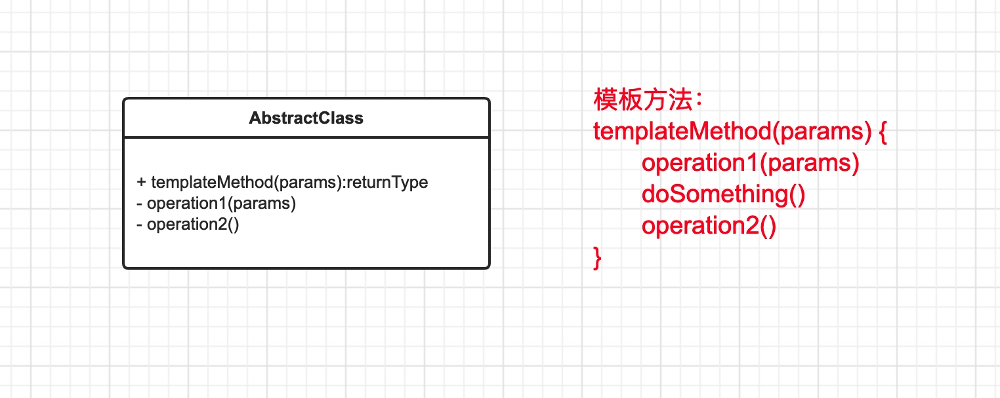

# 模板模式
[TOC]
## 模板模式的定义
模板方法(Template Method)模式: 定义一个操作中的算法的骨架，而将一些步骤延
迟到子类中。使得子类可以不改变一个算法的结构即可重定义该算法的某些特定步骤。

模板方法模式也是为了解决某些变化对系统带来的影响而设计的。使用模板方法使系统扩展性增强，最小化了变化对系统的影响。

## 模板模式结构

- 抽象类
    - 定义了一到多个的抽象方法，以供具体的子类来实现它们
    - 需要实现一个模板方法，来定义一个算法的骨架。该模板方法不仅调用前面的抽象方法，也可以调用其他的操作，只要能完成自身的使命。

- 具体类
实现父类中的抽象方法以完成算法中与特定子类相关的步骤。

### 模板模式 UML

## 使用场景
模板方法适用于以下情况:
- 一次性实现一个算法的不变的部分，并将可变的行为留给子类来实现。
- 各子类中公共的行为应被提取出来并集中到一个公共父类中以避免代码重复。
- 控制子类扩展。
模板方法只在特定点调用操作，这样就只允许在这些点进行扩展。如果你不愿子类来修改你的模板方法定义的框架，你可以采用两种方式来做:一是在 API 中不体现出你的模板方法;或者将你的模板方法置为 final 就可以了。 可以看出，使用模板方法模式可以将代码的公共行为提取出来，达到复用的目的。而且，在模板方法模式中，是由父类的模板方法来控制子类中的具体实现。这样你在实现子类的时候，根本不需要对业务流程有太多的了解。